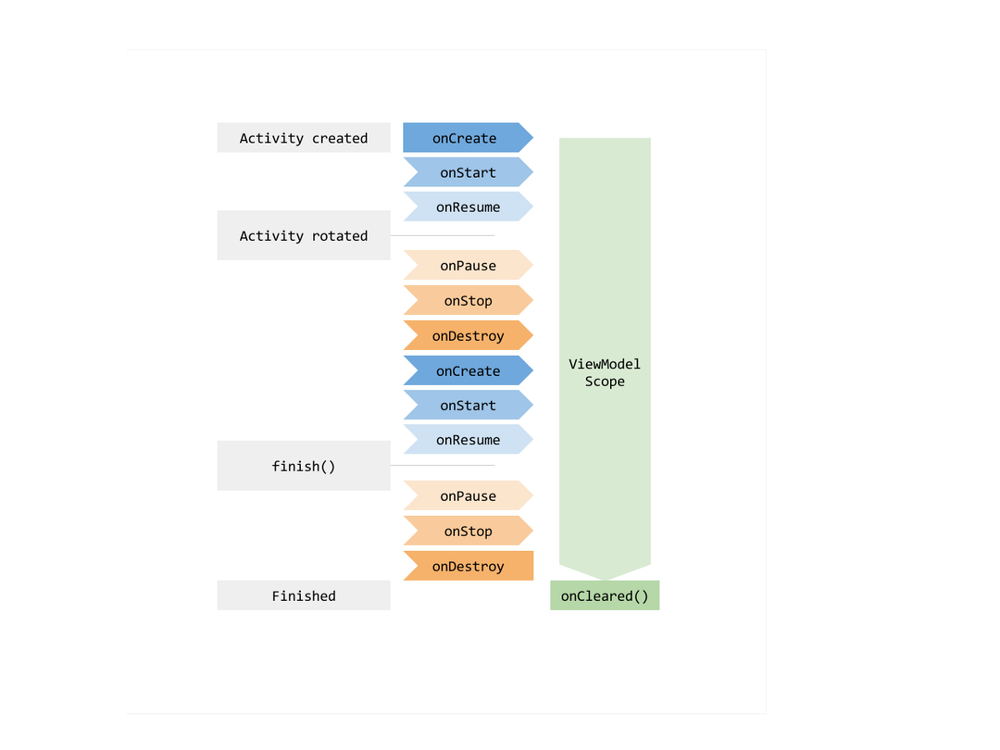

#### 基于Google Android Architecture Component组件设计的MVVM架构

#### 主要分为三层，如下图所示：

##### 由上图可以清晰的看到，整个架构三层分层（DAL层(数据访问层)， DLL层(业务逻辑层)， UI层(表现层)） 十分的清晰明了，各层各司其职，

##### 1. UI层，UI层主要负责视图的显示，不应包含任何业务逻辑的操作，并且UI层不能跨层去访问数据层。

##### 2. ViewModel层（DLL层），主要负责业务逻辑的处理和数据层数据的分发，不应持有View层的任何引用。

##### 3. Repository层（DAL层）， 主要负责数据的处理，包括数据的请求、缓存等。

#### ViewModel生命周期如下图所示：

#### 本框架的各个目录解析

api         接口相关
    
        APIException                            针对于后台接口的错误统一处理为APIException
        APIService                              具体的项目接口定义
base        基类
        
        adapter
                BaseAdapterItem                 针对于多类型RecyclerView抽象的数据项Item
                BaseMultiTypeRecyclerAdapter    多类型RecyclerView的适配器基类
                BaseRecyclerAdapter             单类型的RecyclerView的适配器基类
                RecyclerViewHolder              Holder
di          注入
        
        component                               组件依赖声明
        module                                  
                AppModule                       全局使用的单例
                BuilderModule                   Activity注入声明
                NetworkModule                   网络相关单例
                ViewModelModule                 ViewModel注入声明
        scope                                   注入的组件周期 
extension   扩展

model   数据实体类
        
        Response                                针对于后台接口返回数据统一处理类

repository  数据层

ui      视图层

util    工具类

vo  核心组件

widget  自定义控件

App     Application

#### 使用说明

##### 首先需要将MVVM-Init、 MVVM-Activity、 MVVM-Fragment三个文件夹拷贝到
        android-studio\plugins\android\lib\templates\activities\
##### 然后重启AndroidStudio

##### 1. 使用MVVM Init新建项目，构建完成后，

    app目录下的build.gradle 中注释的这一行
    //apply plugin: 'kotlin-kapt' 打开，
    并删除dependencies中重复的依赖项
    implementation 'com.android.support:appcompat-v7:26.1.0'删除
    即可完成整个项目的构建
    
##### 2. 通过选择app或以下层级目录右键，New -> MVVM -> MVVM Activity或者MVVM Fragment即可新建。

##### 3. 新建好的Activity或者Fragment还需要在di中进行依赖注入的声明：
        
        3.1 无Fragment的Activity声明
        
            @ContributesAndroidInjector
            internal abstract fun mainActivity(): MainActivity
        
            有Fragment的Activity声明
            
                @ContributesAndroidInjector(modules = [(MainModule::class)])
                internal abstract fun mainActivity(): MainActivity
                
            新建MainModule文件中Fragment进行声明
            
                @Module
                abstract class MainModule {
                    @ContributesAndroidInjector
                    abstract fun mainFragment(): MainFragment
                }
        
        3.2 ViewModel需要在ViewModelModule进行声明
        
                @Binds
                    @IntoMap
                    @ViewModelKey(MainViewModel::class)
                    abstract fun bindsMainViewModel(mainViewModel: MainViewModel): ViewModel
                    
##### 4. ViewModel的数据通过 MediatorLiveData或者LiveData暴露给UI
##### 如有其他不足之处，欢迎大家积极进行完善。
        
